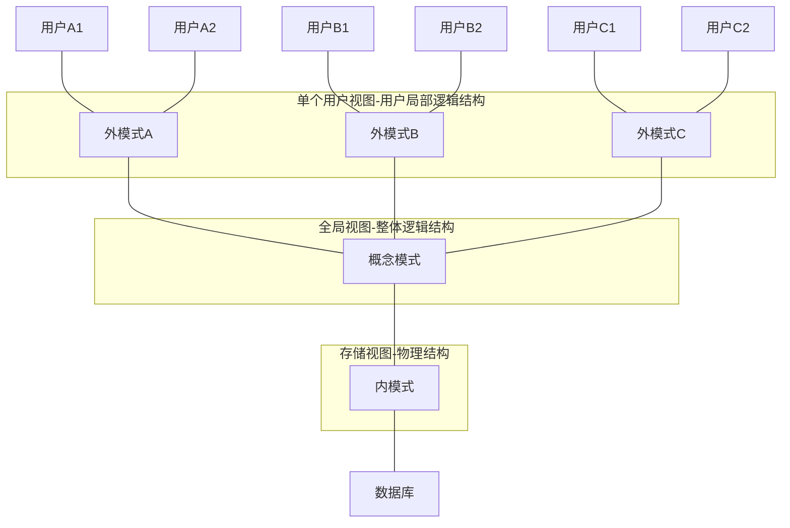

# 数据库系统体系

-----------------------

[TOC]

## 模式结构

### 概念模式

> * **别称**：模式、逻辑模式
> * 给出：逻辑模型
> * **定义**：对数据库全局逻辑结构的描述，是数据库所有用户的公共数据视图
> * **内容**：
>   * 所有实体、 实体的属性和实体间的联系。
>   * 数据的约束。
>   * 数据的语义信息。
>   * 安全性和完整性信息。 

### 外模式

> - **别称**：子模式、用户模式
> - 给出：部分逻辑模型
> - **定义**：是用户观念下局部数据结构的逻辑描述， 是数据库用户 （包括应用程序员和最终用户） 能够看见和使用的局部数据的逻辑结构和特征的描述 
> - **优点**：
>   - 方便用户使用， 简化了用户接口
>   - 保证数据的独立性
>   - 有利于数据共享
>   - 有利于数据安全和保密

### 内模式

> - **别称**：存储模式， 内部模式 
> - 给出：物理模型
> - **定义**：是对数据库中数据物理结构和存储方式的描述， 是数据在数据库内部的表示形式。 定义了所有内部记录类型、 索引和文件的组织方式， 以及所有数据控制方面的细节。 
> - **涉及**：
>   - 数据和索引的存储空间分配。
>   - 用于存储的记录描述 （数据项的存储大小） 。
>   - 记录放置。
>   - 数据压缩和数据加密技术。

### 两级映像和两级数据独立性

> #### 映像
>
> * **定义**：是一种对应规则， 它指出了映像双方是如何进行转换的。 
> * **分类**：
>   * 外模式 / 概念模式映像
>   * 概念模式 / 内模式映像
>
> #### 数据独立性
>
> - **定义**：是指应用程序和数据库的数据结构之间相互独立，不受影响。 
> - **分类**：
>   - 逻辑数据独立性
>     - 外模式不受概念模式变化的影响
>   - 物理数据独立性
>     - 概念模式不受内模式变化的影响

## 数据库（DB）层次

> 对应于模式结构

### 物理数据库

* 以内模式为框架的数据库称为物理数据库。
* 数据库中最里面的一个层次， 是物理存储设备上实际存储着的数据集合。

### 概念数据库

* 以概念模式为框架的数据库称为概念数据库。
* 数据库结构中一个中间层次， 是数据库的整体逻辑表示， 它描述了每一个数据的逻辑定义及数据间的逻辑联系。

### 逻辑数据库

* 以外模式为框架的数据库称为逻辑数据库。
* 数据库结构的最外一层， 是用户所看到和使用的数据库， 因而也称为用户数据库或用户视图。 

## 数据库管理系统（DBMS）

### 工作模式

> 1. 接受应用程序的数据请求和处理请求。
> 2. 将用户的数据请求转换成复杂的机器代码。
> 3. 实现对数据库的操作。
> 4. 从对数据库的操作中接受查询结果。
> 5. 对查询结果进行处理 （格式转换）。
> 6. 将处理结果返回给用户。 

### 主要功能

> * **DQL**：数据库查询语言。关键字：SELECT ... FROM ... WHERE。
>   * 数据通信
> * **DDL** ：数据库模式定义语言。关键字：CREATE，DROP，ALTER。
>   * 外部模式、 概念模式、 内部模式及模式间映像的定义、 数据库完整性定义
> * **DML**：数据操纵语言。关键字：INSERT、UPDATE、DELETE。
> * **DCL**：数据控制语言 。关键字：GRANT、REVOKE。
>   * 完整性检查、安全性控制、并发控制、恢复 
> * **TCL**：事务控制语言。关键字：COMMIT、ROLLBACK、SAVEPOINT。
>   * 数据组织、 存储和管理

### 典型结构

#### C/S

* 用户与管理分离的DBMS

#### WS

* 纯远端DBMS

## 数据库系统（DBS）

### 组成

> * 数 据 库
> * 数据库管理系统
> * 应用开发工具软件和应用程序
> * 数据库的软 / 硬件支撑环境
> * 数据库管理员等部分构成 

### 分类

> * 集中式
>   * 物理集中、逻辑集中
>   * 运行在一台计算机上，不与其它计算机系统交互
> * C/S式
>   * 物理集中、逻辑分布
>   * 将原集中式系统中主机完成的用户界面功能现在由个人计算机来处理，集中式系统变为服务器系统， 以满足客户系统产生的请求 
>   * 多层C/S：数据层、商业逻辑层、视图层
> * 分布式
>   * 物理分布、逻辑集中
> * 并行式
>   * 物理分布、逻辑分布